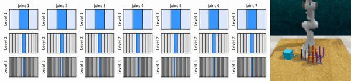
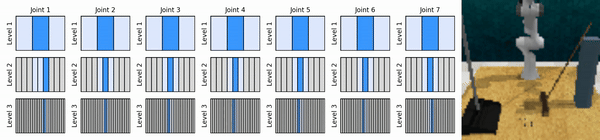

# Continuous Control with Coarse-to-fine Reinforcement Learning

A re-implementation of **Coarse-to-fine Q-Network (CQN)**, a sample-efficient value-based RL algorithm for continuous control, introduced in:

[**Continuous Control with Coarse-to-fine Reinforcement Learning**](https://younggyo.me/cqn/)

[Younggyo Seo](https://younggyo.me/), [Jafar Uruç](https://github.com/JafarAbdi), [Stephen James](https://stepjam.github.io/)

Our key idea is to learn RL agents that zoom-into continuous action space in a coarse-to-fine manner, enabling us to train value-based RL agents for continuous control with few discrete actions at each level.

See our project webpage https://younggyo.me/cqn/ for more information.




## Instructions for RLBench experiments

Install conda environment:
```
conda env create -f conda_env.yml
conda activate cqn
```

Install RLBench and PyRep (latest versions at the date of July 10, 2024 should be used).
Follow the guide in original repositories for (1) installing RLBench and PyRep and (2) enabling headless mode. (See README in [RLBench](https://github.com/stepjam/RLBench) \& [Robobase](https://github.com/robobase-org/robobase?tab=readme-ov-file#rlbench) for information on installing RLBench.)

```
git clone https://github.com/stepjam/RLBench
git clone https://github.com/stepjam/PyRep
# Install PyRep
cd PyRep
git checkout 8f420be8064b1970aae18a9cfbc978dfb15747ef
pip install .
# Install RLBench
cd RLBench
git checkout b80e51feb3694d9959cb8c0408cd385001b01382
pip install .
```

Pre-collect demonstrations
```
cd RLBench/rlbench
CUDA_VISIBLE_DEVICES=0 DISPLAY=:0.0 python dataset_generator.py --save_path=/your/own/directory --image_size 84 84 --renderer opengl3 --episodes_per_task 100 --variations 1 --processes 1 --tasks take_lid_off_saucepan --arm_max_velocity 2.0 --arm_max_acceleration 8.0
```

Run experiments (CQN):
```
CUDA_VISIBLE_DEVICES=0 DISPLAY=:0.0 python train_rlbench.py rlbench_task=take_lid_off_saucepan num_demos=100 dataset_root=/your/own/directory
```

Run baseline experiments (DrQv2+):
```
CUDA_VISIBLE_DEVICES=0 DISPLAY=:0.0 python train_rlbench_drqv2plus.py rlbench_task=take_lid_off_saucepan num_demos=100 dataset_root=/your/own/directory
```

## Instructions for DMC experiments

Run experiments:
```
CUDA_VISIBLE_DEVICES=0 python train_dmc.py dmc_task=cartpole_swingup
```

Warning: CQN is not extensively tested in DMC


## Acknowledgements
This repository is based on public implementation of [DrQ-v2](https://github.com/facebookresearch/drqv2)


## Citation
```
@article{seo2024continuous,
  title={Continuous Control with Coarse-to-fine Reinforcement Learning},
  author={Seo, Younggyo and Uru{\c{c}}, Jafar and James, Stephen},
  journal={arXiv preprint arXiv:2407.07787},
  year={2024}
}
```